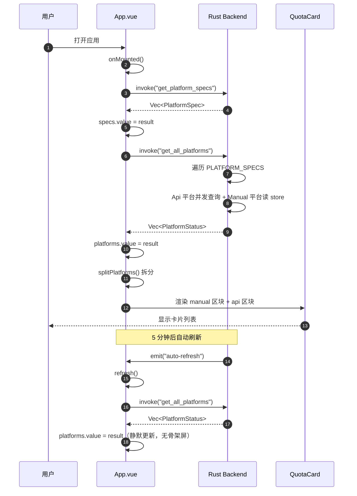
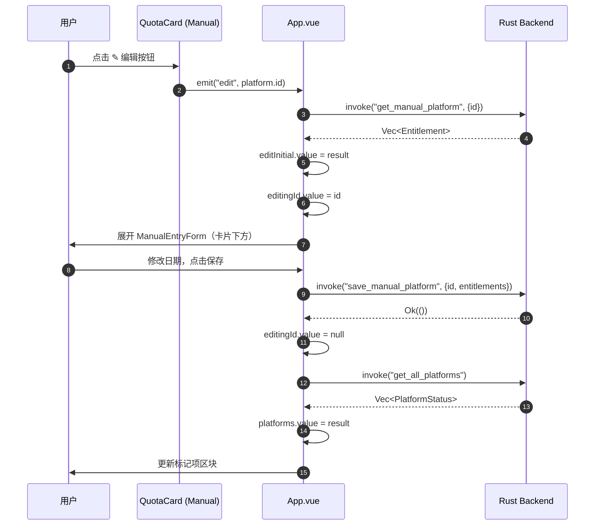
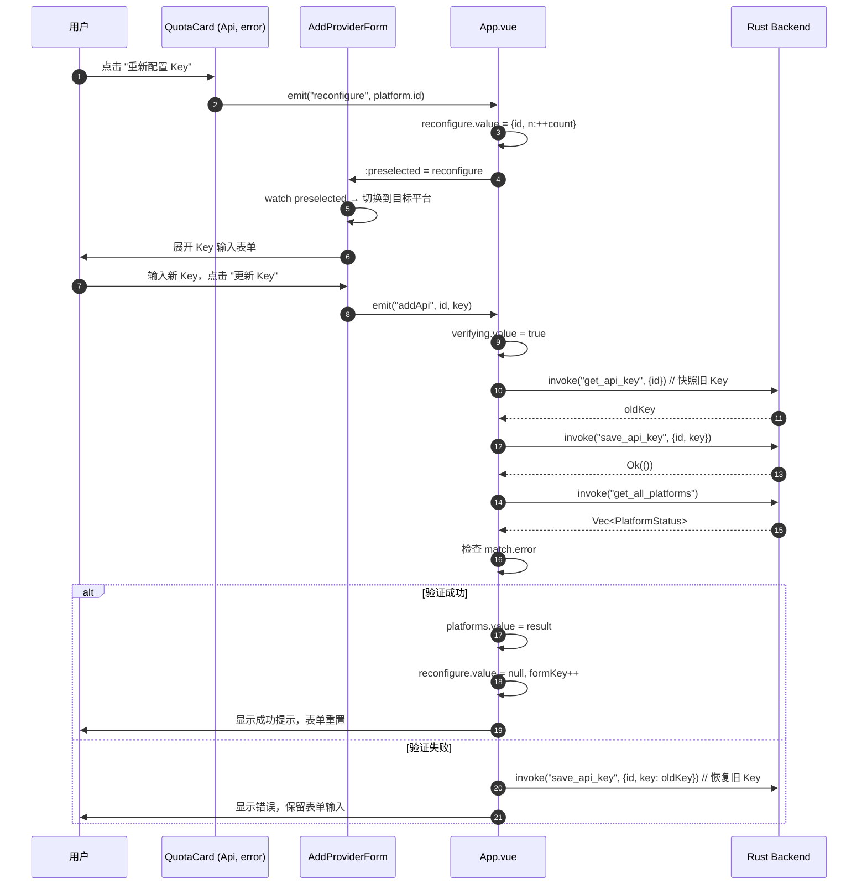
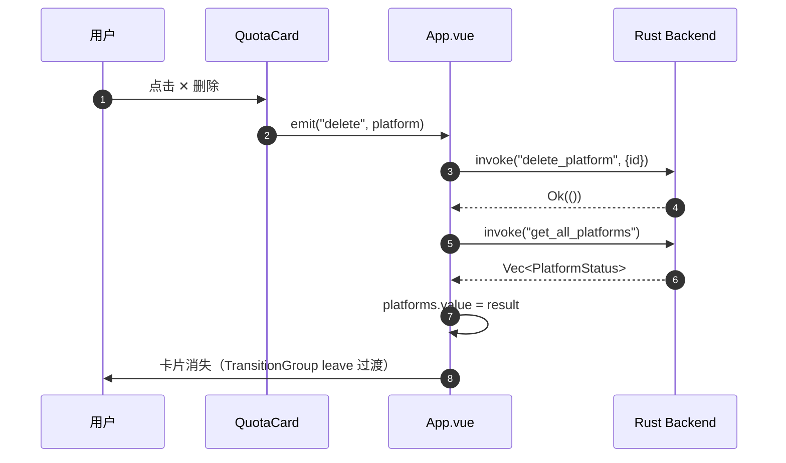
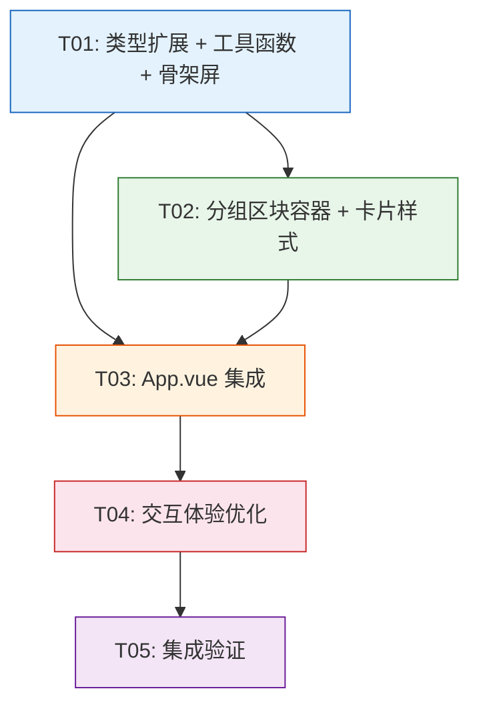

# KeyKeeper 架构设计：标记项/普通项分离 + 前端优化

> 设计人：架构师（software-architect）· 日期：2026-09
> 上游输入：PRD（Alice）· 代码库现状审查
> 设计原则：最小变更、不引入新依赖、保持 serde 契约、既有成熟项目增量优化

---

## Part A: 系统设计

### 1. 实现方案

#### 1.1 核心难点与对策

| # | 难点 | 对策 |
|---|------|------|
| D1 | Manual 平台（标记项）与 Api 平台（普通项）混排在同一列表，视觉与操作逻辑无区分 | **前端 computed 拆分**：`manualPlatforms` / `apiPlatforms` 两个 computed，各自独立排序（保留现有 urgency 排序），App.vue 渲染两个独立区块。**不改 Rust 侧**——`source` 字段已存在且 serde 序列化为 `'api'`/`'manual'`，拆分完全在前端完成 |
| D2 | 标记项与普通项交互链路不同（Manual 就地编辑 vs Api 重配置 Key） | 在 `QuotaCard.vue` 已通过 `isManual()` 分支处理，拆分后各自区块内复用现有逻辑，仅调整外层容器与标题 |
| D3 | 首屏加载体验差（"加载中..."纯文字） | 骨架屏组件 `SkeletonCard.vue`，复用 QuotaCard 尺寸结构，Vue `<Transition>` 淡入淡出 |
| D4 | 360px 最小宽度下布局可能溢出 | 固定宽度场景**不引入响应式断点**，采用 `min-w-0` + `truncate` + `overflow-x-hidden` 的降级策略，保证单列布局完整性 |
| D5 | 空状态与错误重试体验粗糙 | 空状态用插画式 SVG 图标 + 引导文案；错误重试在 QuotaCard 已有 `retry` 按钮，拆分后保留 |
| D6 | 卡片增删缺少过渡动画 | Vue `<TransitionGroup>` 包裹列表，定义 `list-enter-active` / `list-leave-active` CSS 过渡 |

#### 1.2 框架与库选型

**不引入任何新依赖**。现有技术栈完全满足需求：

| 需求 | 现有方案 | 理由 |
|------|----------|------|
| 分组渲染 | Vue `computed` + `v-for` | 数据规模 ≤8，无需虚拟列表 |
| 过渡动画 | Vue `<Transition>` / `<TransitionGroup>` | 内置功能，零成本 |
| 骨架屏 | 纯 TailwindCSS 动画类 `animate-pulse` | 无需额外库 |
| 空状态 | 内联 SVG + TailwindCSS | 无需图标库 |
| 排序 | 现有 `sortPlatforms` + `platformUrgency` | 已满足 urgency 排序 |

#### 1.3 架构模式

**MVVM（Model-View-ViewModel）**：
- **Model**：Rust 端 `PlatformStatus` / `PlatformSpec` / `Entitlement`，前端 `types.ts` 镜像
- **ViewModel**：`App.vue` 的 `<script setup>` 部分——所有 `ref`/`computed`/事件处理函数
- **View**：Vue SFC 模板 + TailwindCSS 样式

状态管理沿用**单文件集中式**（App.vue 持有全部状态），不引入 Pinia——8 个平台规模下 Pinia 是过度设计。

---

### 2. 文件清单

```
src/
├── App.vue                          # [改] 拆分 manual/api 两组，骨架屏，TransitionGroup
├── types.ts                         # [不改] 与 Rust serde 契约对齐，无需变动
├── utils.ts                         # [改] 新增 splitPlatforms() 拆分函数 + SkeletonCard 尺寸常量
├── components/
│   ├── QuotaCard.vue                # [改] 新增 source 属性透传，微调样式区分
│   ├── AddProviderForm.vue          # [不改]
│   ├── ManualEntryForm.vue          # [不改]
│   ├── RefreshBar.vue               # [改] loading 状态文案微调（"刷新中..."→ spinner 图标）
│   ├── PlatformSection.vue          # [新] 分组区块容器（标题 + 卡片列表 + 空状态）
│   └── SkeletonCard.vue             # [新] 骨架屏卡片（animate-pulse）
└── style.css                        # [改] 新增 TransitionGroup / Transition 过渡样式

docs/
├── system_design.md                 # [新] 本文档
├── sequence-diagram.mermaid         # [新] 时序图
└── class-diagram.mermaid            # [新] 类图
```

**Rust 侧零改动**：`models.rs` / `commands.rs` / `scheduler.rs` / `lib.rs` / `keystore.rs` / `adapters/*` 全部保持原样。

---

### 3. 数据结构与接口

#### 3.1 类图

```mermaid
classDiagram
    direction TB

    %% ── 数据模型（与 Rust serde 对齐）──
    class Entitlement {
        +string label
        +number|null expires_at
        +QuotaUnit unit
        +number|null total
        +number|null remaining
        +string|null note
        +number|null used_percent
    }

    class PlatformStatus {
        +string id
        +string display_name
        +Source source
        +Entitlement[] entitlements
        +string|null console_url
        +string|null error
        +number updated_at
    }

    class PlatformSpec {
        +string id
        +string display_name
        +PlatformMode mode
        +string console_url
        +string key_docs_url
        +string key_hint
        +string key_pattern
    }

    class Source {
        <<enumeration>>
        api
        manual
    }

    class QuotaUnit {
        <<enumeration>>
        cny
        tokens
        seconds
        unknown
    }

    PlatformStatus "1" --> "0..*" Entitlement : entitlements
    PlatformStatus --> Source : source
    Entitlement --> QuotaUnit : unit

    %% ── 前端 ViewModel（App.vue）──
    class AppViewModel {
        -Ref~PlatformSpec[]~ specs
        -Ref~PlatformStatus[]~ platforms
        -Ref~boolean~ loading
        -Ref~boolean~ verifying
        -Ref~string~ lastUpdated
        -Ref~string~ error
        -Ref~string~ success
        -Ref~{id:string,n:number}|null~ reconfigure
        -Ref~string|null~ editingId
        -Ref~Entitlement[]~ editInitial
        -Computed~PlatformStatus[]~ sortedPlatforms
        -Computed~PlatformStatus[]~ manualPlatforms
        -Computed~PlatformStatus[]~ apiPlatforms
        -Computed~string[]~ configuredIds
        +refresh() void
        +addApi(id, key) void
        +addManual(id, entitlements) void
        +startEdit(id) void
        +saveEdit(id, entitlements) void
        +deletePlatform(p) void
        +startReconfigure(id) void
    }

    AppViewModel --> PlatformStatus : manages
    AppViewModel --> PlatformSpec : reads

    %% ── 工具函数 ──
    class Utils {
        +dateInputToTimestamp(str) number
        +timestampToDateInput(ts) string
        +daysLeft(expiresAt) number
        +formatDate(ts) string
        +dateInputInDays(n) string
        +entitlementBadge(e) Badge
        +isLowBalance(e) boolean
        +platformUrgency(p) number
        +sortPlatforms(list) PlatformStatus[]
        +splitPlatforms(list) PlatformGroup
    }

    class PlatformGroup {
        +PlatformStatus[] manual
        +PlatformStatus[] api
    }

    Utils --> PlatformStatus : sorts
    Utils --> PlatformGroup : splits

    %% ── 组件 ──
    class QuotaCard {
        +PlatformStatus platform
        +emit delete
        +emit retry
        +emit reconfigure
        +emit edit
        +isManual() boolean
        +isAuthError() boolean
    }

    class PlatformSection {
        +string title
        +PlatformStatus[] platforms
        +boolean loading
        +string emptyText
        +emit delete
        +emit retry
        +emit reconfigure
        +emit edit
    }

    class SkeletonCard {
        <<pure visual>>
    }

    class AddProviderForm {
        +PlatformSpec[] specs
        +string[] configuredIds
        +{id,n}|null preselected
        +boolean disabled
        +emit addApi
        +emit saveManual
        +emit cancelReconfigure
    }

    class ManualEntryForm {
        +Entitlement[] initial
        +emit save
        +emit cancel
    }

    class RefreshBar {
        +string lastUpdated
        +boolean loading
        +emit refresh
    }

    AppViewModel --> QuotaCard : renders
    AppViewModel --> PlatformSection : renders
    AppViewModel --> AddProviderForm : renders
    AppViewModel --> RefreshBar : renders
    PlatformSection --> QuotaCard : contains
    PlatformSection --> SkeletonCard : loading state
```

#### 3.2 接口定义

**Tauri Commands（不变）**：

| 命令 | 签名 | 说明 |
|------|------|------|
| `get_all_platforms` | `() -> Vec<PlatformStatus>` | 汇总所有平台状态 |
| `get_platform_specs` | `() -> Vec<PlatformSpec>` | 平台元数据 |
| `save_api_key` | `(id: String, key: String) -> Result<(), String>` | 保存 Api Key |
| `get_api_key` | `(id: String) -> Result<String, String>` | 读取 Api Key |
| `delete_platform` | `(id: String) -> Result<(), String>` | 删除平台 |
| `save_manual_platform` | `(id: String, entitlements: Vec<Entitlement>) -> Result<(), String>` | 保存手动录入 |
| `get_manual_platform` | `(id: String) -> Result<Vec<Entitlement>, String>` | 读取手动录入 |

**前端 computed 拆分函数**（`utils.ts` 新增）：

```typescript
interface PlatformGroup {
  manual: PlatformStatus[];  // 标记项（Manual 源）
  api: PlatformStatus[];     // 普通项（Api 源）
}

export function splitPlatforms(list: PlatformStatus[]): PlatformGroup {
  return {
    manual: sortPlatforms(list.filter((p) => p.source === 'manual')),
    api: sortPlatforms(list.filter((p) => p.source === 'api')),
  };
}
```

**组件 Props 接口**：

```typescript
// PlatformSection.vue
interface Props {
  title: string;                    // 区块标题，如 "标记项" / "普通项"
  platforms: PlatformStatus[];      // 已排序的平台列表
  loading: boolean;                 // 首屏加载状态（仅首次加载显示骨架屏）
  emptyText: string;                // 空状态文案
  icon: 'flag' | 'api';            // 区块图标类型
}
```

---

### 4. 程序调用流程

#### 4.1 首屏加载流程



#### 4.2 标记项就地编辑流程



#### 4.3 普通项重配置 Key 流程



#### 4.4 删除平台流程



---

### 5. 待明确事项

| # | 事项 | 设计决策 | 理由 |
|---|------|----------|------|
| Q1 | 标记项区块为空时是否隐藏整个区块？ | **隐藏**——`v-if="manualPlatforms.length > 0"` | 无标记项时不显示空区块，减少视觉噪音 |
| Q2 | 普通项区块标题文案 | **"API 平台"**（非"普通项"） | 用户视角：Api 平台 vs 手动标记，"API 平台"更直观 |
| Q3 | 标记项区块标题文案 | **"手动标记"** | 与现有 QuotaCard 的"手动"徽章文案一致 |
| Q4 | 两组排序是否跨组保持全局 urgency？ | **组内独立排序**——各自按 urgency 排 | 用户需求明确"组内排序保留现有 urgency 排序"，不跨组混排 |
| Q5 | 骨架屏显示时机 | **仅首屏**（`platforms.length === 0 && loading`） | 后续刷新静默更新，避免闪烁 |
| Q6 | 是否给 QuotaCard 增加 source 属性？ | **不增加**——`platform.source` 已可判断 | `isManual()` 已通过 `platform.source === 'manual'` 实现，无需额外 props |
| Q7 | 过渡动画时长 | 进入 200ms / 离开 150ms | 小窗口工具应用，快速响应感 |

---

## Part B: 任务分解

### 6. 所需依赖

**零新增依赖**。现有 `package.json` 完全满足：

```
# 现有（不变）
- vue@^3.5.13
- @tauri-apps/api@^2
- @tauri-apps/plugin-opener@^2
- @tauri-apps/plugin-store@^2
- tailwindcss@^3.4.17
- typescript@~5.6.2
- vite@^6.0.3
- vue-tsc@^2.1.10
```

### 7. 任务列表

| 任务ID | 任务名称 | 目标文件 | 改动内容 | 依赖 | 优先级 |
|--------|----------|----------|----------|------|--------|
| **T01** | 项目基础设施：类型扩展 + 工具函数 + 骨架屏组件 | `src/types.ts`（不改）、`src/utils.ts`（新增 `splitPlatforms` + `PlatformGroup` 类型）、`src/components/SkeletonCard.vue`（新建）、`src/style.css`（新增 Transition 样式） | ① `utils.ts` 新增 `PlatformGroup` 接口 + `splitPlatforms()` 函数；② 新建 `SkeletonCard.vue`——纯视觉骨架屏卡片，`animate-pulse` 动画，尺寸对齐 QuotaCard；③ `style.css` 新增 `<Transition>` 和 `<TransitionGroup>` 的 CSS 过渡类（`list-enter-active` / `list-leave-active` / `fade-enter-active` 等） | 无 | P0 |
| **T02** | 分组区块容器 + 卡片样式微调 | `src/components/PlatformSection.vue`（新建）、`src/components/QuotaCard.vue`（微调） | ① 新建 `PlatformSection.vue`——接收 `title` / `platforms` / `loading` / `emptyText` props，内部渲染区块标题（带图标）+ `v-for` QuotaCard + 空状态 + 骨架屏；② `QuotaCard.vue` 微调——标题行增加 source 图标（📌/🔄），卡片边框颜色按 source 微区分（Manual: `border-amber-200`，Api: `border-neutral-300`） | T01 | P0 |
| **T03** | App.vue 集成：拆分渲染 + 骨架屏 + 过渡动画 | `src/App.vue` | ① 用 `splitPlatforms(platforms.value)` 替代 `sortedPlatforms`，得到 `manualPlatforms` / `apiPlatforms`；② 列表区域改为两个 `PlatformSection`（标记项 + 普通项），用 `v-if` 控制空区块隐藏；③ 首屏加载时显示 `SkeletonCard`（`v-if="loading && platforms.length === 0"`）；④ 用 `<TransitionGroup>` 包裹两个列表，启用过渡动画；⑤ 保留所有现有事件处理函数不变 | T01, T02 | P0 |
| **T04** | 交互体验优化：空状态 + 错误重试 + 按钮微交互 | `src/components/PlatformSection.vue`、`src/components/RefreshBar.vue`、`src/App.vue` | ① `PlatformSection` 空状态改为 SVG 图标 + 引导文案（"暂无手动标记的平台，点击上方添加"）；② `RefreshBar` loading 状态改为 spinner 图标 + "刷新中"文案；③ 按钮统一加 `active:scale-95` 微交互；④ `App.vue` 的 `showSuccess` / `showError` 消息条加 `<Transition>` 淡入淡出 | T03 | P1 |
| **T05** | 集成验证：类型检查 + 构建 + 视觉走查 | 全项目 | ① `pnpm exec vue-tsc --noEmit` 零错误；② `pnpm build` 成功；③ `pnpm tauri dev` 手动验证：首屏骨架屏 → 卡片渲染 → 标记项/普通项分区 → 过渡动画 → 360px 宽度布局完整性 | T04 | P0 |

### 8. 共享知识

**跨文件约定**：

- **类型命名**：`PlatformStatus` / `PlatformSpec` / `Entitlement` / `Source` / `QuotaUnit` 与 Rust 端 serde 契约一一对应，**禁止前端私自增加后端不存在的字段**
- **事件命名**：组件 emit 事件用 kebab-case（`@add-api` / `@save-manual` / `@cancel-reconfigure`），与现有代码一致
- **source 判断**：`platform.source === 'manual'` 判断标记项，`=== 'api'` 判断普通项——统一用 `isManual()` 函数
- **样式约定**：
  - 标记项卡片边框：`border-amber-200`（淡琥珀色，视觉区分）
  - 普通项卡片边框：`border-neutral-300`（现有）
  - 区块标题：`text-xs font-semibold text-neutral-500 uppercase tracking-wider`
  - 骨架屏：`animate-pulse bg-neutral-200 rounded`
- **排序约定**：组内统一使用 `sortPlatforms()`（urgency 排序），不跨组混排
- **Tauri 命令**：所有 invoke 调用集中在 `App.vue`，组件不直接 invoke
- **错误处理**：`showError()` / `showSuccess()` 统一在 App.vue，组件通过 emit 上报
- **日期语义**：`dateInputToTimestamp()` / `timestampToDateInput()` / `daysLeft()` 是唯二日期工具，不自建

### 9. 任务依赖图



**并行机会**：T01 完成后，T02 和 T03 可部分并行（T03 依赖 T01 的 `splitPlatforms`，但不依赖 T02）。但为简化执行，建议串行 T01 → T02 → T03 → T04 → T05。

---

## 附录：架构审查点（供后续阶段 doc/ 落盘）

| # | 审查点 | 现状 | 建议 |
|---|--------|------|------|
| A1 | App.vue 状态集中度 | 253 行，全部 ref/computed 集中 | 可接受（8 平台规模），但建议后续提取 `usePlatforms` composable |
| A2 | 无 shallowRef | `platforms` / `specs` 用 `ref` | ≤8 平台，响应式开销可忽略，暂不改 |
| A3 | 无虚拟列表 | 全量渲染 | ≤8 平台，不需要 |
| A4 | 适配器未终验 | 3 个 Api 适配器未经真实 Key 验证 | 需在真实 Key 环境下终验 |
| A5 | 手动录入并发安全 | `manual_write_lock` 已保护 | 已解决 |
| A6 | 自动刷新与验证互斥 | `verifying` 时跳过自动刷新 | 已解决 |
